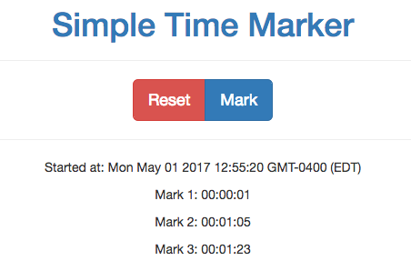

# Simple Time Marker

People who watch or edit video sometimes want to remember the times of specific moments in the video, to
extract clips later or create highlight reels.  This tool can be useful.  Open it on your phone, hit "Start"
when the video starts, then hit "Mark" at each point in time you wish to remember.  Later, refer to the list
of times as needed, and hit "Reset" to clear and start over.

